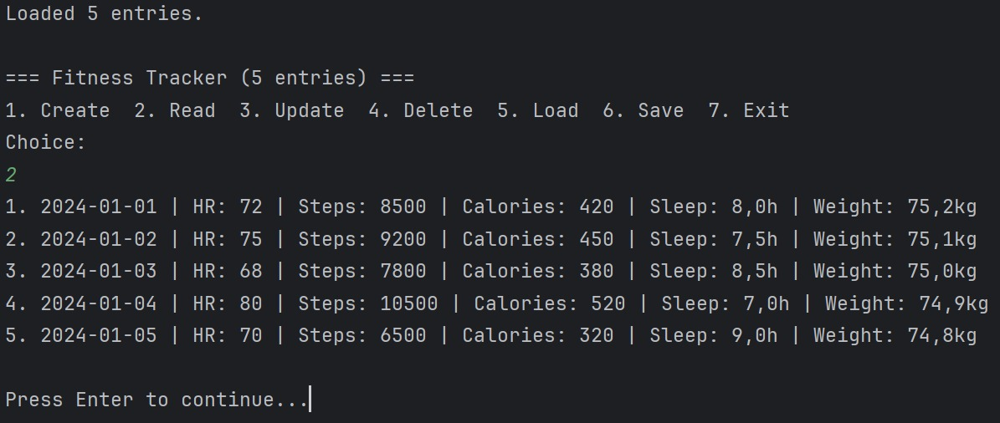

# Fitness Tracker CSV Logger

A console-based Java application for tracking daily fitness metrics with CSV data persistence.

<div align="center">
  
</div>

## 📋 Overview

Track daily fitness data (heart rate, steps, calories, sleep, weight) with automatic CSV storage and comprehensive validation.

## 🏗️ Architecture

```
src/   
├── fitnesscsvlogger/  
│   ├── FitnessEntry.java       # Data model with validation  
│   ├── CsvHandler.java         # File I/O operations  
│   └── FitnessTracker.java     # Main application  
│   test/  
│   ├── FitnessEntryTest.java   # Model unit tests  
│   └── CsvHandlerTest.java     # File I/O tests  
data/  
└── fitness.csv                 # Default fitness data storage
```

## 🚀 Features

- CRUD Operations: Create, Read, Update, Delete fitness entries  
- CSV Storage: Automatic save/load with error recovery  
- Input Validation: Heart rate, steps, calories, sleep (0-24h), weight  
- Clean Interface: Minimal console menu system  

## 🛠️ Technologies

- Java 17+ - Core language  
- JUnit 5 - Unit testing framework  
- CSV Format - Human-readable data storage  
